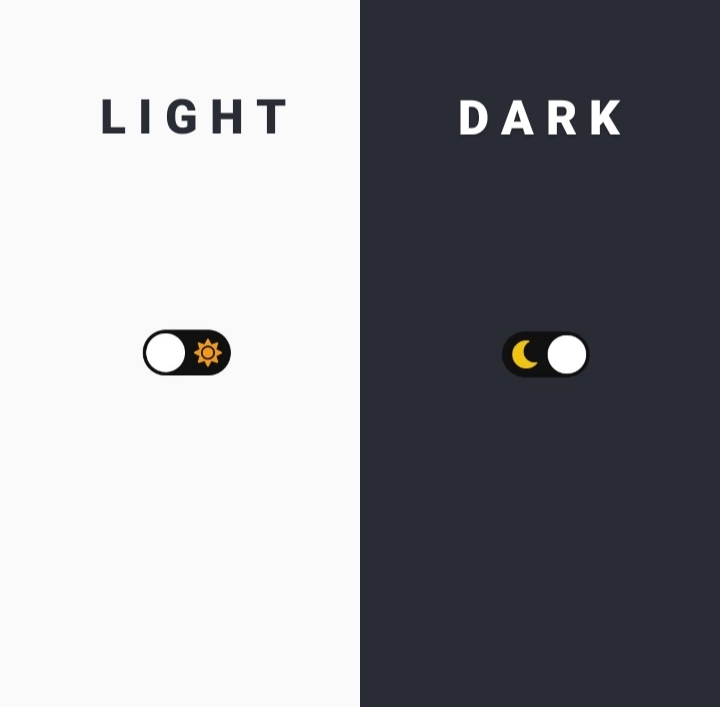

<h1 align="center">Dark & Light Theme Button </h1>

Project developed for personal study of Front-End.  

  <a href="#-technologies">Technologies</a>&nbsp;&nbsp;&nbsp;|&nbsp;&nbsp;&nbsp;
  <a href="#-project">Project</a>&nbsp;&nbsp;&nbsp;|&nbsp;&nbsp;&nbsp;
  <a href="#-layout">Layout</a>

 

## 🔥 Layout

  

## 🌐 Technologies

This project was developed with the following technologies:

- HTML and CSS
- JavaScript

## 💻 Project

ButtonDarkLight is a simple project designed to change the screen theme/mode to dark or light every time you click the button.

- [Visit the project online](https://esthefany-dev.github.io/buttonDarkLight/)

---

👩‍💻 by [Esthefany-Dev](https://github.com/Esthefany-Dev)
